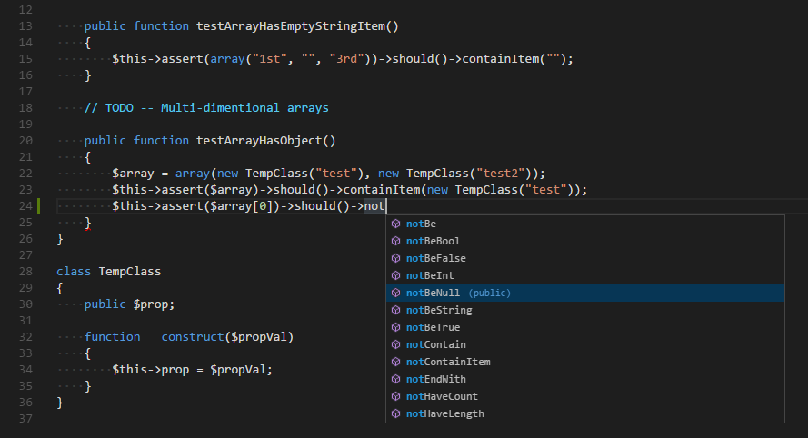
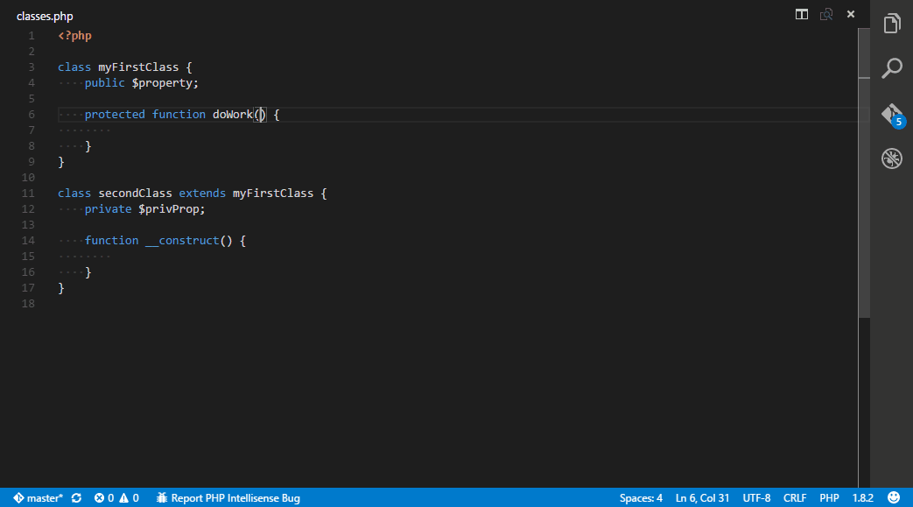

# README

*Icon by http://icons8.com/*

## Crane - PHP Intellisense/code-completion for VS Code

Please go to https://github.com/HvyIndustries/crane for source code, bug tracking and feature requests.

## Functionality

This extension provides semi-intelligent Intellisense and code-completion suggestions for VS Code.

Make sure you have the PHP linter enabled, and set to run `onType` instead of `onSave`!

## Demo

## Upcoming features

* F12 Go to definition
* Find references
* List symbols

## Known Issues

* Syntax errors in a file prevent completion suggestions being generated
* Currently the extension does not provide suggetions for class instance variables (eg. `$instance = new class()`)

### More Info

* [Repository](https://github.com/HvyIndustries/crane)
* [VS Code Marketplace](https://todo)

**Please report any bugs you find!**
